# Accessing the Tenancy and configuring the IAM (and other accounts)

To walk through this workshop, in addition to the Oracle Cloud account, you will need to have a Github account, that will also allow you to connect directly to Wercker. Both will be used intensively. We will show how to register and login those services.

## Oracle Cloud Account

### Signing Up for Oracle Cloud Infrastructure

You can sign up for Oracle Cloud Infrastructure in the following ways:

* Contact your Oracle sales representative.
  * Your Oracle sales representative can provide you information about the pricing options available to your company.
* Go to [https://cloud.oracle.com/tryit](https://cloud.oracle.com/tryit) and sign up for the Free Oracle Cloud Promotion.
  When your request is processed, you will be provisioned a tenancy in Oracle Cloud Infrastructure. Oracle will send you a Welcome email with instructions for signing in to the Console for the first time. There is no charge unless you choose to Upgrade to Paid from My Services.

### Signing In to the Console

You can understand better the sign-in options [here](https://docs.cloud.oracle.com/iaas/Content/GSG/Concepts/signinoptions.htm) and have more information about the sign-in [here](https://docs.cloud.oracle.com/iaas/Content/GSG/Tasks/signingin.htm).

To sign in to Oracle Cloud at <https://cloud.oracle.com>, you need:

* User name and password
* Your cloud account name

When your tenancy is provisioned, Oracle sends an email to the default administrator at your company with the sign-in credentials and URL. This administrator can then create a user for each person who needs access to Oracle Cloud Infrastructure. Check your email or contact your administrator for your credentials and account name.

The direct links for signing in are provided in your welcome email, but you can also follow the instructions bellow:

* Open a supported browser and go to <https://cloud.oracle.com>.
* Click Sign In.
* Enter your Cloud Account Name and click Next.
* Enter your user name and temporary password from your welcome email. You will be prompted to change your temporary password.

After you sign in, the Console Home page is displayed.

Alternatively, you can sign in directly to Oracle Cloud Infrastructure using the Console URL. When you sign up to use Oracle Cloud Infrastructure, you receive a customized URL for your organization. For example,

    https://console.us-ashburn-1.oraclecloud.com/?tenant=CompanyABC

If you instead use the base URL (<https://console.us-ashburn-1.oraclecloud.com> - verify your home region: it's ashburn in this example), you are prompted to specify your tenant (or cloud account name) on the sign-in page, along with your user name and password.

## Github Account

### What's GitHub

According to themselves:
> GitHub is a development platform inspired by the way you work. From open source to business, you can host and review code, manage projects, and build software alongside 40 million developers.

In this workshop, we will basically use your personal account to [fork a repo](https://help.github.com/en/articles/fork-a-repo), edit some Java code and sign in and integrate to Wercker.

> A fork is a copy of a repository. Forking a repository allows you to freely experiment with changes without affecting the original project.

GitHub can do much more, but we will use only the colaborative code repository feature.

### Creating a free account on GitHub

Access the sign-up web page <https://github.com/join>.

Fill the form with your information.

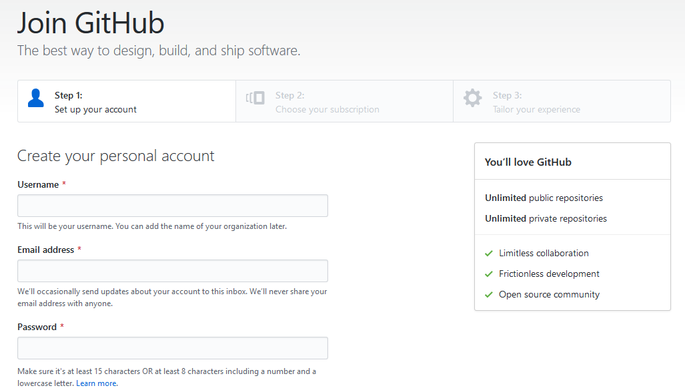

Solve the puzzle.

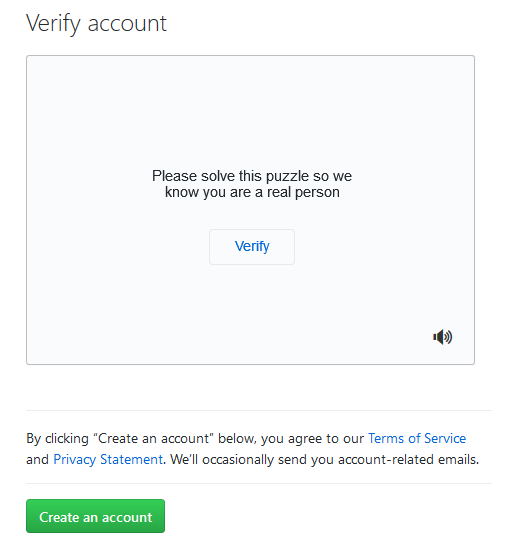

Choose the Free subscription.

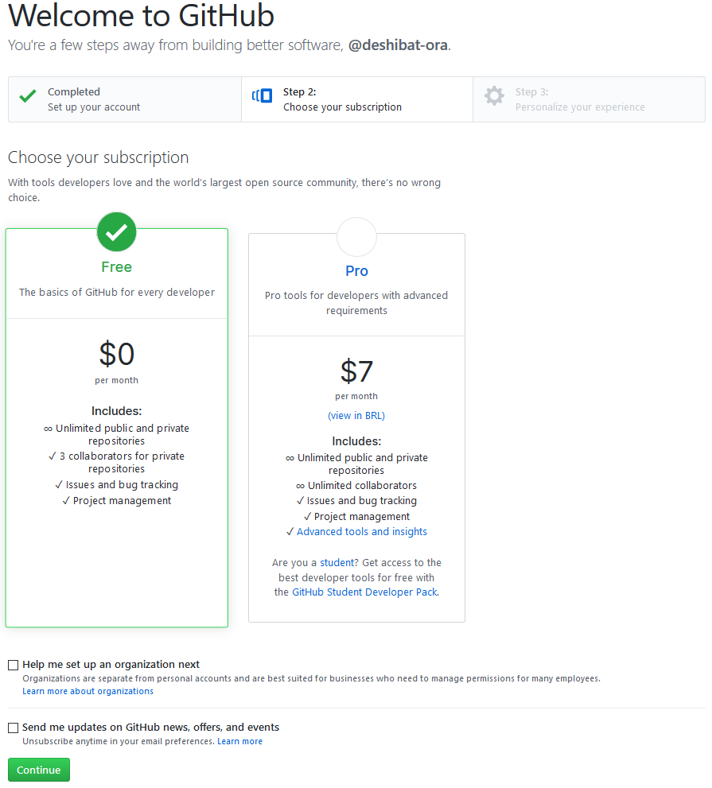

Inform what you are interested in (optional).

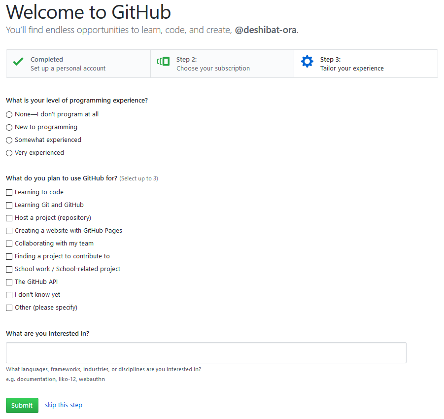

Now you have to verify you e-mail address.

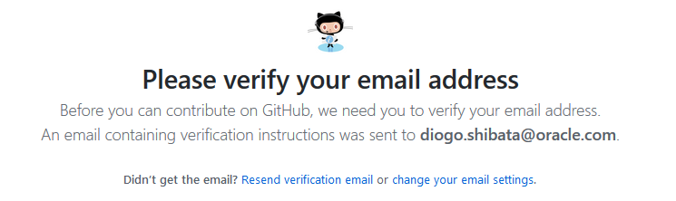

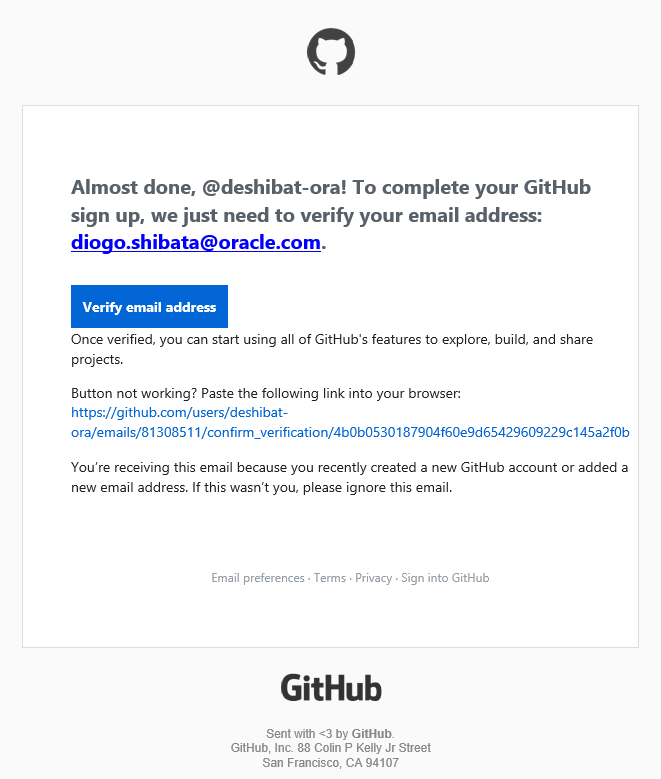

Your account is ready to be used, but you will not create anything now.

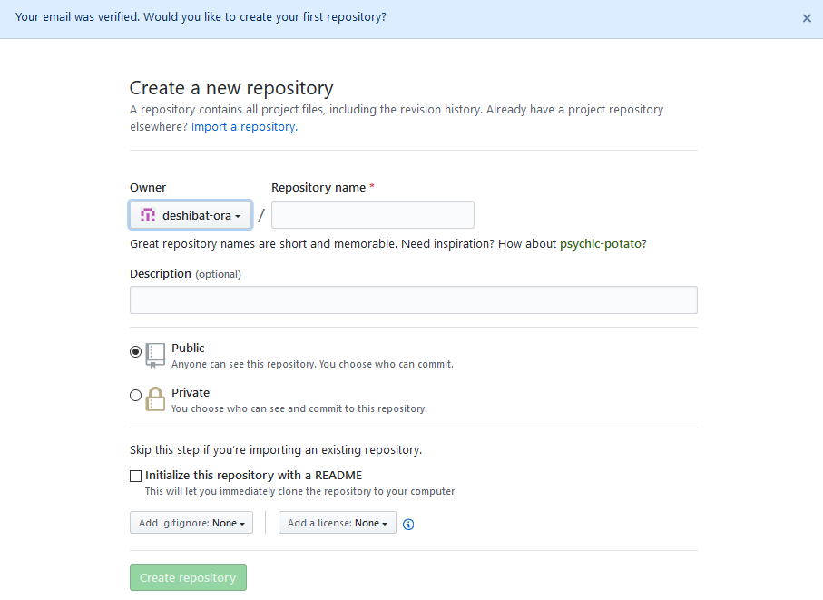

Let's get started with the Wercker account configuration.

## Wercker Account

### What's Wercker

Wercker is an enterprise acquired by Oracle in 2017. [The official note explains](https://www.oracle.com/corporate/acquisitions/wercker/):

> Wercker empowers organizations and their development teams to achieve continuous integration and continuous delivery (CI/CD) goals with micro-services and Docker. This is brought to life through Wercker’s container-centric and cloud-native automation platform comprised of their local command line interface (CLI), online SaaS platform and API.
>
>
> Oracle and Wercker share the view that developers greatly benefit from focusing on building great products and applications. Oracle is building a leading IaaS and PaaS platform as the foundation for a new generation of cloud computing. A leading cloud needs great tooling and adding Wercker’s container lifecycle management to Oracle’s Cloud provides engineering teams with the developer experience they deserve to build, launch and scale their applications. Together, Oracle and Wercker will democratize developer tooling for the modern cloud.

At the official web site, you can find more information about [Wercker Features](https://devcenter.wercker.com/overview-and-core-concepts/wercker-features/) and a complete [Wercker Glossary](https://devcenter.wercker.com/supplementary-information/wercker-glossary/).

### Acessing a Wercker free account

You can understand better the sign-up and sign-in options [here](https://devcenter.wercker.com/introductions/create-account/).

Access the sign-up web page <https://app.wercker.com/users/new>.

Select the "SIGN UP USING GITHUB" option.

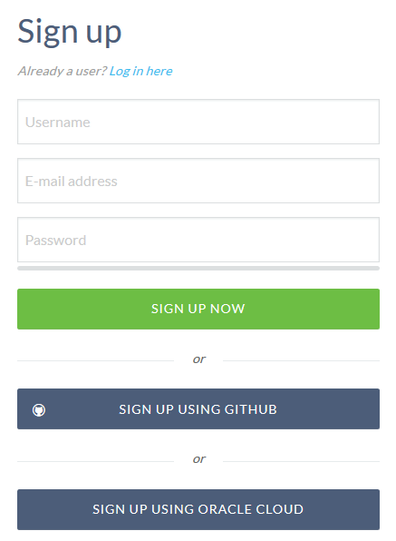

Provide your GitHub account login information.

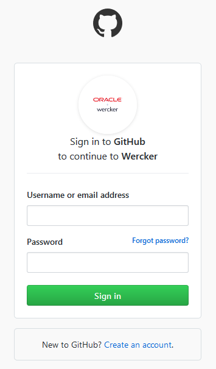

Authorize Wercker to connect to GitHub.

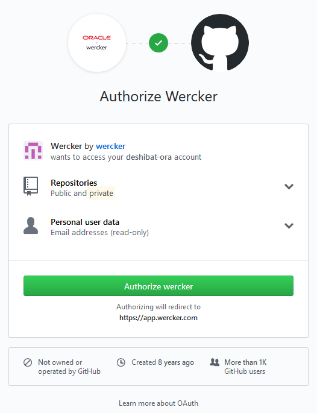

Inform the username and the e-mail address you want to associate to your new Wercker account.

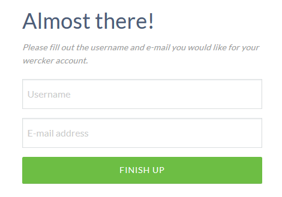

Prove you are not a robot.

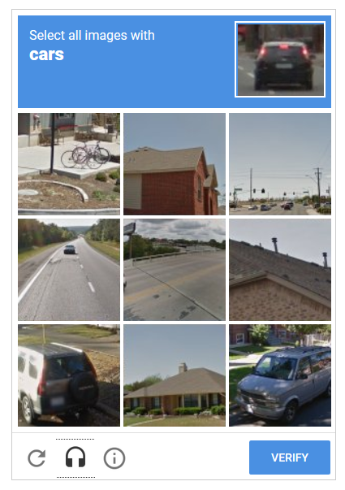

Now you are ready to use Wercker, but we will get back here soon.

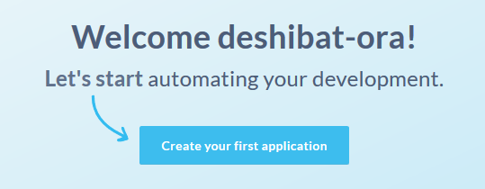

## Accessing your Oracle Cloud Account)

### Accessing the OCI Console

To sign in to your Tenancy anytime (before you have changed your password), you can follow the instruction bellow:

Open a supported browser and go to <https://cloud.oracle.com>.

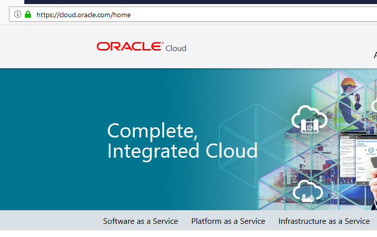

Click the **Sign In** button.

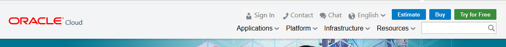

Enter your Cloud Account Name and click the **Next** button.

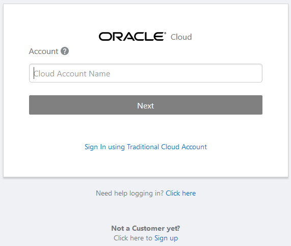

Enter your user name and password and click the **Sign In** button.

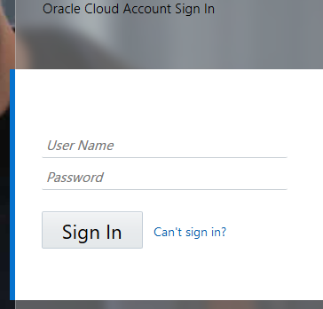

Your console interface will start loading.

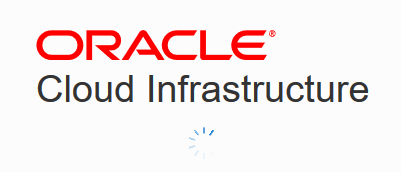

After you sign in, the Console Home page is displayed.

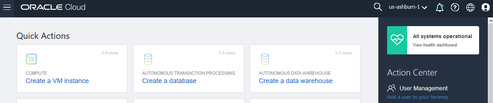

## Configuring IAM data and gathering some information

Now you have to get some data about your environment that will be used in the next labs and configure the IAM at the same time.

The information you will need to save in a text file:

* Tenancy OCID
* Object Storage Namespace
* Compartment OCID
* User OCID
* Username
* API Public Key Fingerprint
* Auth Token

You will configure the following objects:

* Create a policy
* Create a compartment
* Add an API Public Key
* Generate a Auth Token

### Get Tenancy OCID and Object Storage Namespace

Menu --> Administration --> Tenancy Details

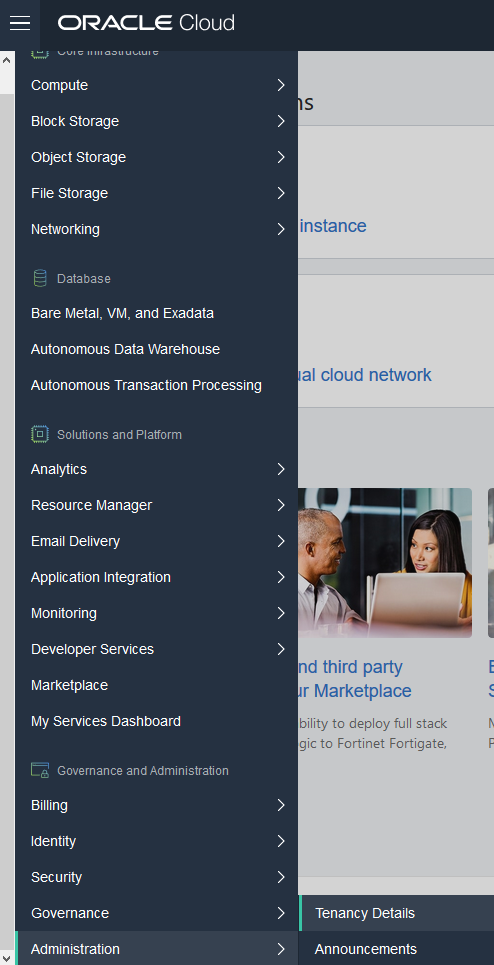

Copy the Tenancy OCID and the Object Storage Namespace.

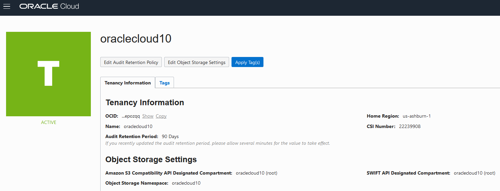

You can also access this screen from the up-right button.

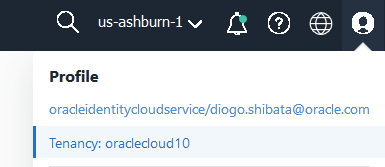

### Create Policy

Menu --> Identity --> Policies

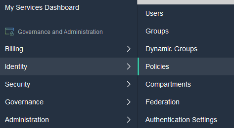

Click the **Create Policy** button.

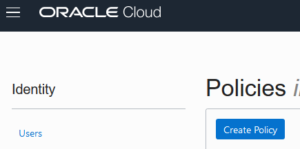

Data:

* Description: Workshop Policy
* Policy Versioning: Keep Policy current
* Statement: allow service OKE to manage all-resources in tenancy

Click the **Create** button

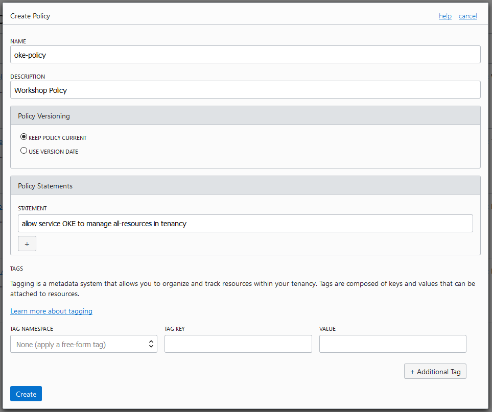

### Create Compartment and get Compartment OCID

Menu --> Identity --> Compartments

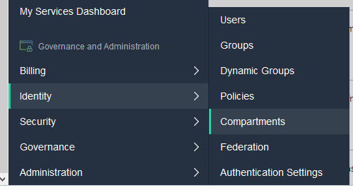

Click the **Create Compartment** button.

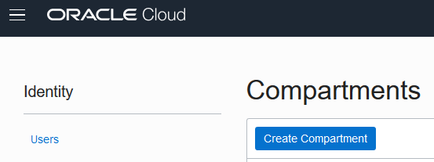

Data:

* Name: OKE-Workshop
* Description: Workshop Compartment
* Parent Compartment: *your Tenancy name* (root)

Click the **Create Compartment** button.

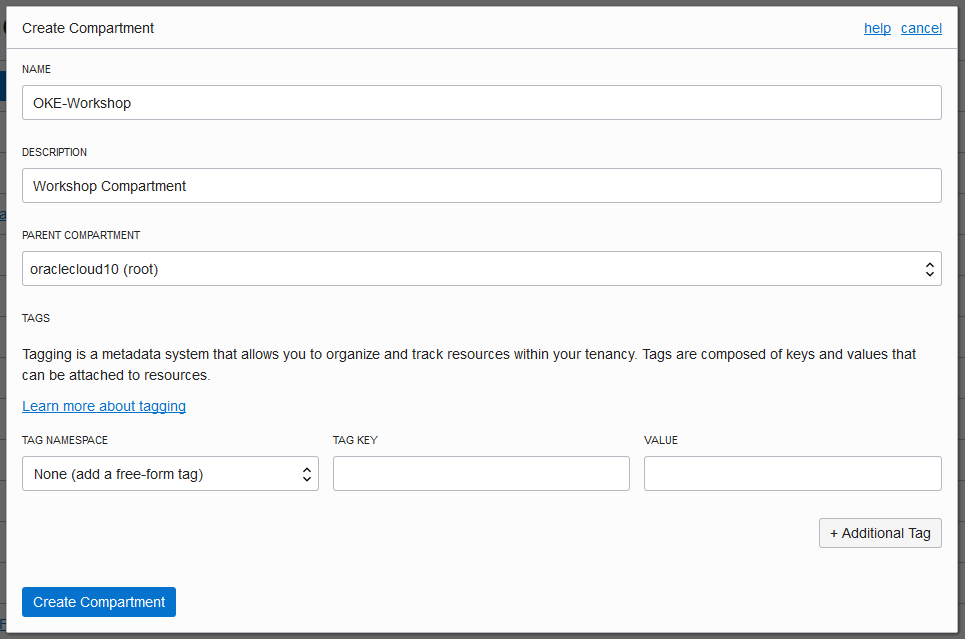

Copy the Compartment OCID.

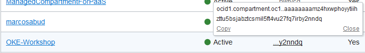

### Get User OCID and Username

Menu --> Identity --> Users.

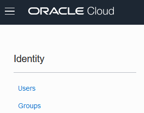

Select your main user (administrator - probably composed by the e-mail address you logged in with).

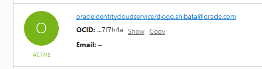

Copy the complete Username and the User OCID.

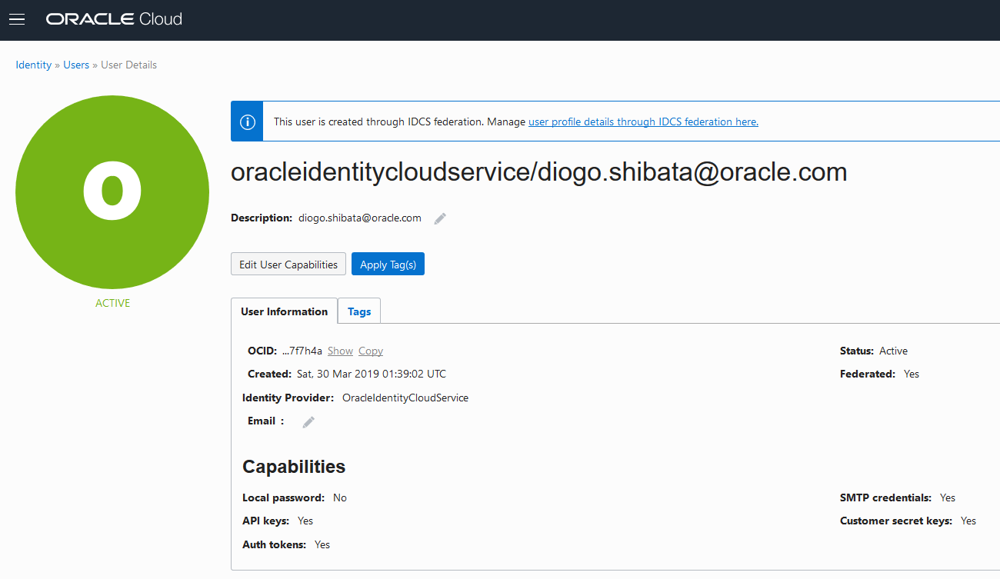

### Add API Public Key and get fingerprint

Click the **Add Public Key** button.

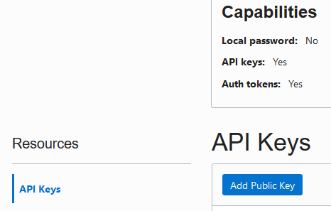

Copy the [PEM Public Key](https://github.com/diogoshibata/terraform-bastion/raw/master/terraform/ssh-keys/oci_api_key_public.pem) (/terraform/ssh-keys/oci_api_key_public.pem) and paste into the blank space. Click the **Add** button.

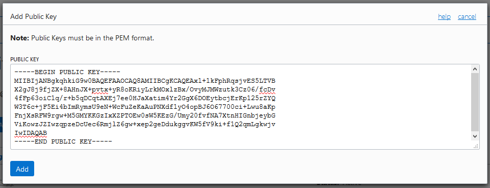

Copy the API Key Fingerprint (2d:b9:0f:d1:0d:07:1c:a7:d2:ad:47:8e:fc:7c:18:80).

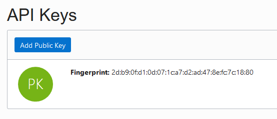

### Generate and save Auth Token

Open the Auth Tokens section.

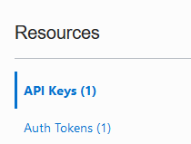

Click the **Generate Token** button.

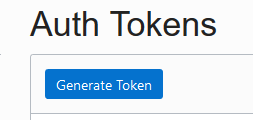

Data:

* Description: Workshop Auth Token

Click the **Generate Token** button.

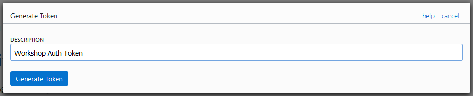

Copy the Generated Token and click the **Close** button.

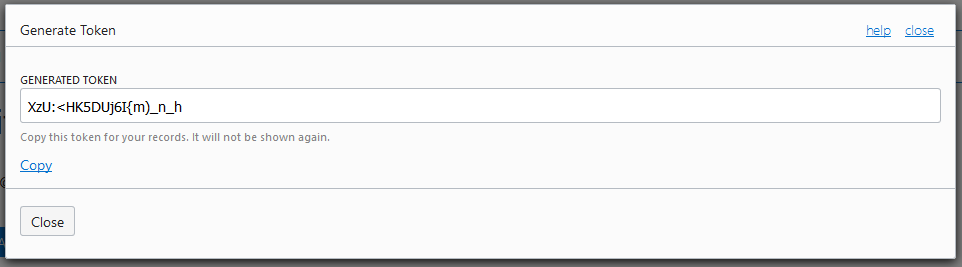

Now you got all the information needed to proceed to the next Lab.
