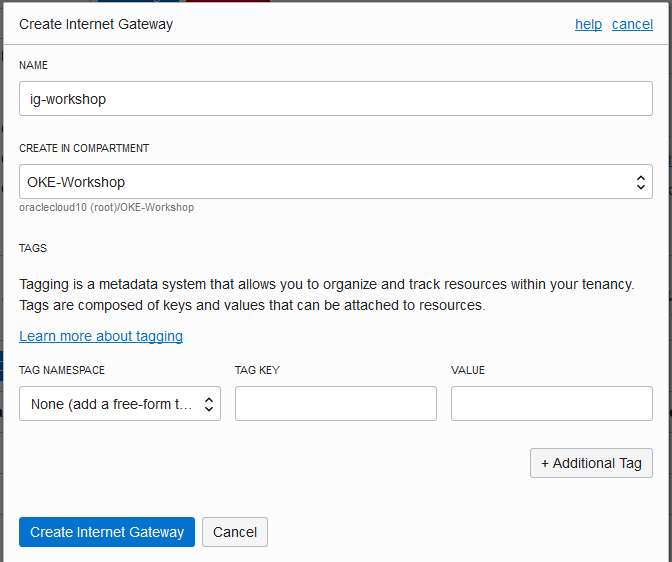

# Creating and configuring the cloud infrastructure resources (except Bastion Host VM)

We will not use many networking resources in this workshop like Dynamic Routing Gateways (DRG), Customer-Premises Equipment (CPE), IPSec Connections, Load Balancers, FastConnect, DNS Zone Management and Traffic Management Steering Policies. You can find more information about them at the official [Oracle Cloud Infrastructure Documentation](https://docs.cloud.oracle.com/iaas/Content/Network/Concepts/overview.htm).

## Create a Virtual Cloud Network (VCN)

Menu --> Networking --> Virtual Cloud Networks

Verify if you are at the right compartment

Click the **Create Virtual Cloud Network** button

Data:
* Name: 
* Compartment: 
* [x] Create Virtual Cloud Network Only
* CIDR Block: 192.168.0.0/16
* DNS Resolution: [x] Use DNS hostnames in this VCN
* DNS Label: 
* [x] View detail after this resource is created
  
Click the **Create Virtual Cloud** button.

### Internet Gateway

Select the *Internet Gateways* section.

Click the **Create Internet Gateways** button

Data:
* Name: ig-workshop
* Create in Compartment: OKE-Workshop

Click the **Create Subnet** button

### Routes

### Security

### Subnet

Select the *Subnets* section.

Click the **Create Subnet** button

Data:
* Name: sub01
* Subnet Type
  * [x] Regional (Recommended)
* CIDR Block: 192.168.1.0/24
* Route Table: Bastion Route Table
* Subnet Access
  * [x] Public Subnet
* DNS Resolution
  * [x] Use DNS hostnames in this SUBNET
* DNS Label: 
* DHCP Options: Default DHCP Options for vcn-workshop
* Security List: Bastion Security List

Click the **Create Subnet** button

Now you are ready to proceed to the [Lab 070: Creating, accessing and configuring the Bastion Host VM](https://github.com/diogoshibata/terraform-bastion/blob/master/Lab%20070/lab070.md).