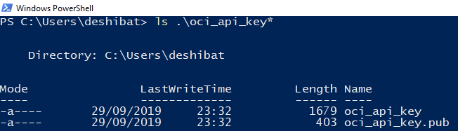
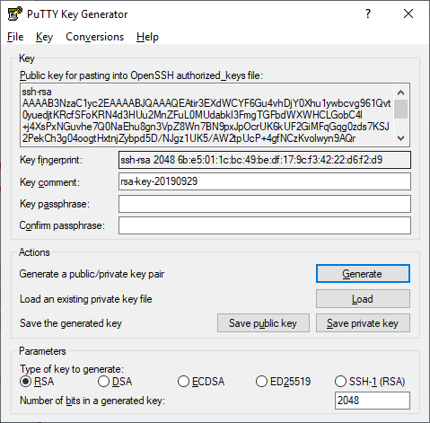
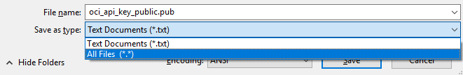
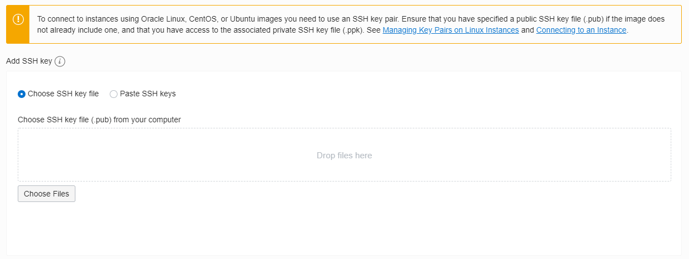
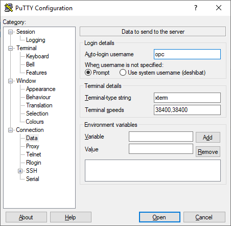

# Creating, accessing and configuring the Bastion Host VM

## Creating

Before you can create your Linux Virtual Machine at Oracle Cloud, you will need a SSH Key Pair to make it possible to connect to your instance. For this workshop, we already provide you the SSH Keys in all the needed extensions: [/terraform/ssh-keys/](https://github.com/diogoshibata/terraform-bastion/tree/master/terraform/ssh-keys) (they are also in the downloaded zip file).

### Keys

Depending on the Operating System you are using, there will be different ways to create a SSH Key Pair. We will explore the ssh-keygen (Linux or Windows PowerShell) and the PuTTYgen (Windows application) tools.

#### Linux Command Line Shell or Windows PowerShell

Both Linux Command Line and Windows PowerShell use the ssh-keygen tool to create a PEM SSH Key Pair. More details can be found [here](https://docs.cloud.oracle.com/iaas/Content/Compute/Tasks/managingkeypairs.htm#two)

Run the following commands (you must be administrator or act as a superuser - *sudo*):

>
> ssh-keygen -t rsa -b 2048 -f $HOME/oci_api_key
>

You can use a password to improve the security level of access to the VM. As shown in the image bellow, no password is used in thhis workshop.

After running the commands, the SSH Key Pair's path it will be shown at the Command Line Interface (CLI). You can list then by typing:

>
> ls .\oci_api_key*
>

#### PuTTYGen

The documentation also explains how to create [an SSH Key Pair Using PuTTY Key Generator](https://docs.cloud.oracle.com/iaas/Content/Compute/Tasks/managingkeypairs.htm#three).

Download and install the PuTTY application from the [official website](https://www.chiark.greenend.org.uk/~sgtatham/putty/latest.html). You can also use the *portable version* of PuTTY (used to access remote VMs) and PuTTYgen (used to create the SSH Key Pair).

Open the PuTTYgen software.

Specify a *key type* of SSH-2 RSA and a key size of 2048 bits.

Click **Generate**.

Move your mouse around the blank area in the PuTTYgen window to generate random data in the key. When the key is generated, it appears under Public key for pasting into OpenSSH authorized_keys file.

A Key comment is generated for you, including the date and time stamp. You can keep the default comment or replace it with your own more descriptive comment.
Leave the Key passphrase field blank.

Click **Save private key**, and then click **Yes** in the prompt about saving the key without a passphrase.

Name the key *oci_api_key.ppk*. PPK (PuTTY Private Key) format is a proprietary format that works only with the PuTTY tool set.

Select all of the generated key that appears under Public key for pasting into OpenSSH authorized_keys file. Copy it using Ctrl + C, paste it into a text file, and then save the file in the same location as the private key with the name *oci_api_key_public.pub*.

Remember (or write down) the names and location of your public and private key files. You will need the public key when launching an instance and the private key to access the instance via SSH.

Now you are ready to create the Bastion VM (our Compute Instance).

### Compute Instance

Now we must access our Bastion Host VM instance and configure the OCI Command Line Interface (OCI CLI).

## Accessing

### Using PuTTY in Windows

### Using Linux Shell or Windows PowerShell

>
> ssh opc@129.213.101.79 -i .\oci_api_key.pem -L 8001:localhost:8001
>

## Configuring the Bastion Host VM

> 
> bash -c "$(curl -L https://raw.githubusercontent.com/oracle/oci-cli/master/scripts/install/install.sh)"
> 

>
> exec -l $SHELL
> clear
> 

### Update and install packages

> 
> sudo yum update -y
> sudo yum install kubectl -y
>

### Install and configure OCI CLI

