# Using the Resource Manager to create infrastructure resources and configure Bastion Host VM

The labs from 040 to 070 were simplified into this one Terraform zip file. It can be found at [/terraform/terraform.zip](https://github.com/diogoshibata/terraform-bastion/blob/master/terraform/terraform.zip). I encourage you to explore and understand the code of the files in the zip.

As it's a simplification made exclusively for this workshop, if you want to use it as base for the creation of your own scripts, I highly recommend you to remove any sensitive data that could be exposed (like Auth Token and Keys' information).

## Using the Terraform Zip File

First of all, [download the zip file](https://github.com/diogoshibata/terraform-bastion/raw/master/terraform/terraform.zip) (/terraform/terraform.zip) to a local area. You will need to upload it to the Resource Manager.

### Access the Resource Manager and Create the Stack

Menu --> Resource Manager --> Stacks

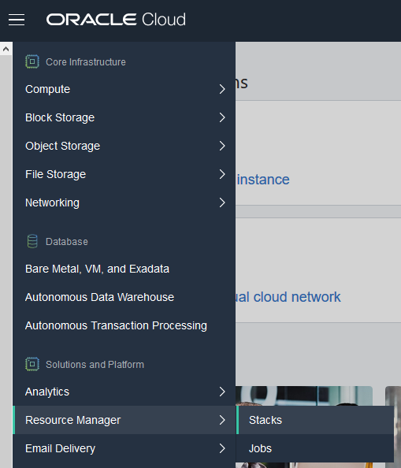

Click the **Create Stack** button.

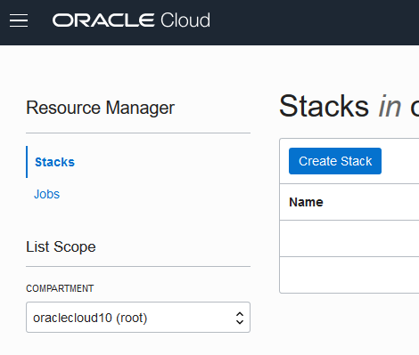

Upload the file "terraform/terraform.zip" (or drag and drop it to the specified area).

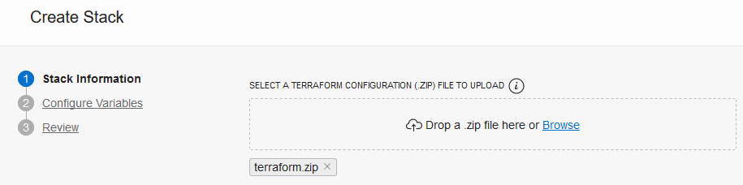

Data:

* Name: bastion-stack
* Description: Deploy a bastion host on Oracle Cloud Infrastructure to manage the Oracle Container for Kubernetes (OKE) Cluster and all other needed resources.
* Create in Compartment: *your tenancy* (root)

Click the **Next** button.

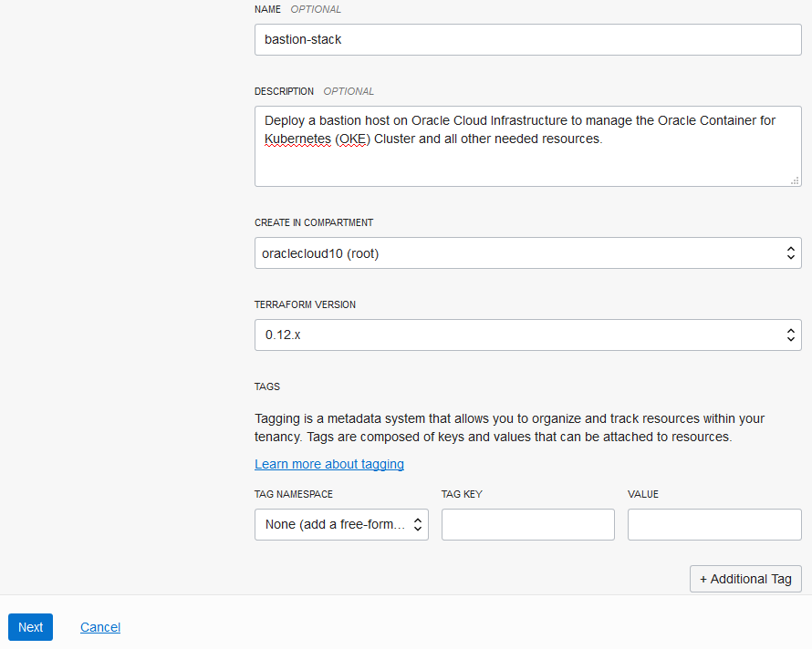

Inform the User OCID that you saved before and use all other default information. Take some time to analyze the data, assure that all the fields are filled and click the **Next** button after that.

If you see a screen like the one bellow, you can click the **Create** button.

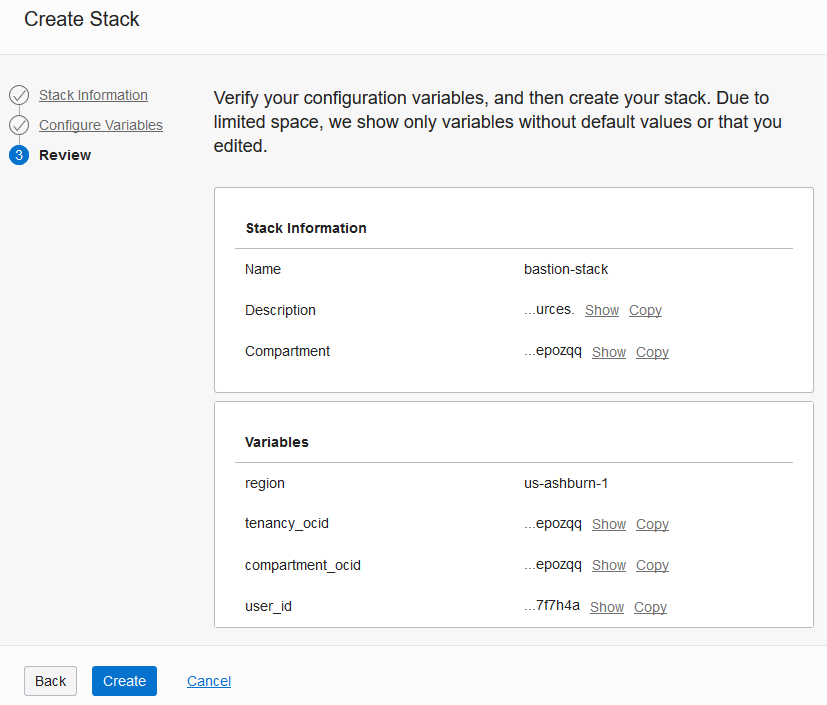

### Plan and Apply

You probably reached the Stack Details screen.

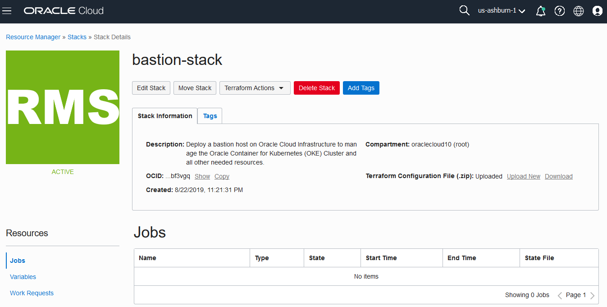

Now you can *plan* you stack. The Resource Manager will run the *plan* command of the managed Terraform service. This is explained by HashiCorp:

> The *terraform plan* command is used to create an execution plan. Terraform performs a refresh, unless explicitly disabled, and then determines what actions are necessary to achieve the desired state specified in the configuration files.
>
>This command is a convenient way to check whether the execution plan for a set of changes matches your expectations without making any changes to real resources or to the state. For example, *terraform plan* might be run before committing a change to version control, to create confidence that it will behave as expected.

It must run before you *apply* the configuration files.

HashiCorp also defines the *apply* command:

>The *terraform apply* command is used to apply the changes required to reach the desired state of the configuration, or the pre-determined set of actions generated by a *terraform plan* execution plan.

So, let's use both of them.

**Terraform Action** --> Plan

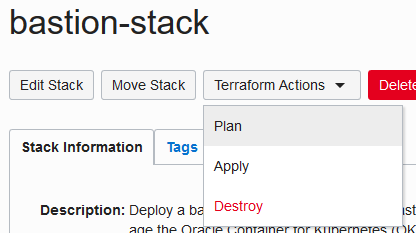

Use the default data and click the **Plan** button.

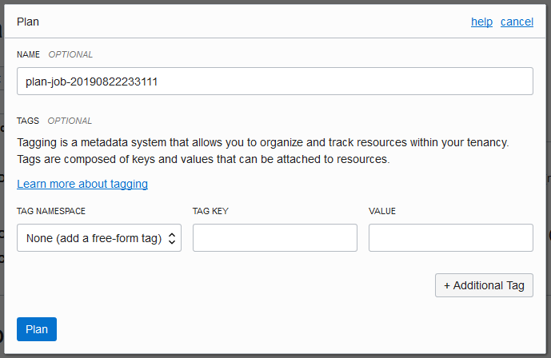

The Plan Job will be accepted and start the needed verifications.

When it finishes, you can have a complete log of what was planned.

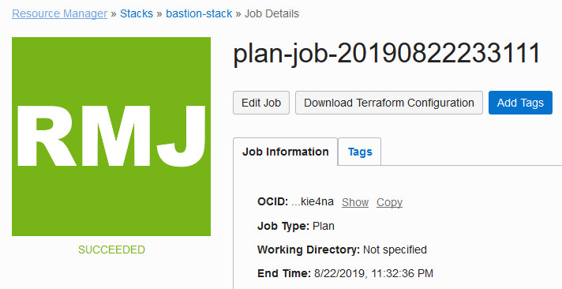
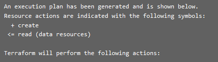

Reach back the bastion-stack details page.

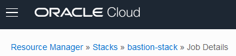

Now you can *apply* what you have already planned.

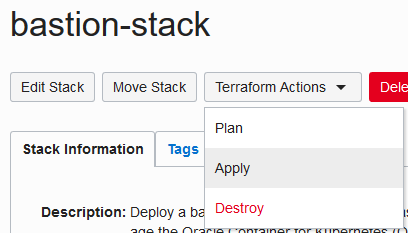

Use the default data and click the **Apply** button.

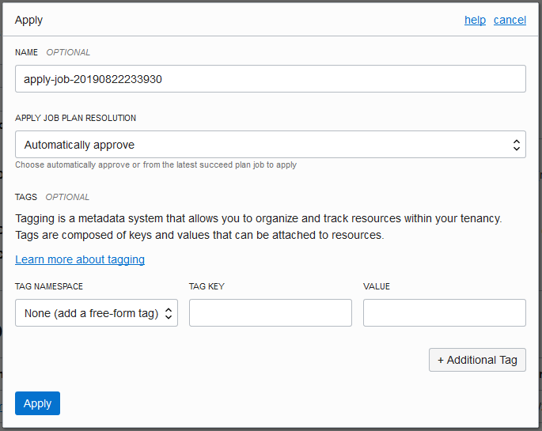

Just like when you planned the execution, your request is received and a console with all the information of the apply job is shown.

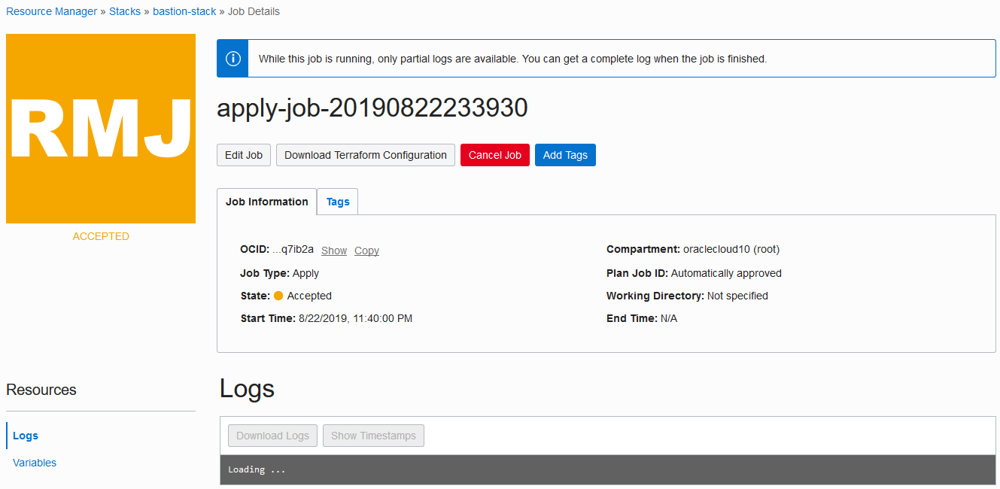

It will take some time to complete the job (around 15 minutes), because of the commands executed after the Bastion Host VM is up and running. This is done to standardize the VM to all participants of the workshop. After the job is finished, you can see the information you will need at the end of the console log or at the output section.

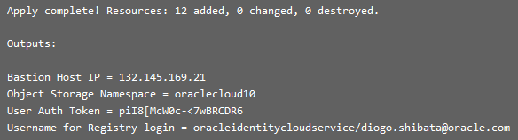
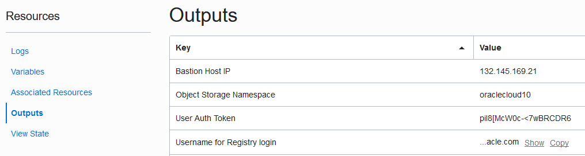

Right now you have everything you need to manage your Kubernetes cluster from your Remote Bastion VM. Outside the Hands-On Lab, you can use your own local machine to manage directly the OKE cluster.

Let's go to the [Lab 200](https://github.com/diogoshibata/terraform-bastion/blob/master/Lab%20200/lab200.md) and create a OKE cluster.
