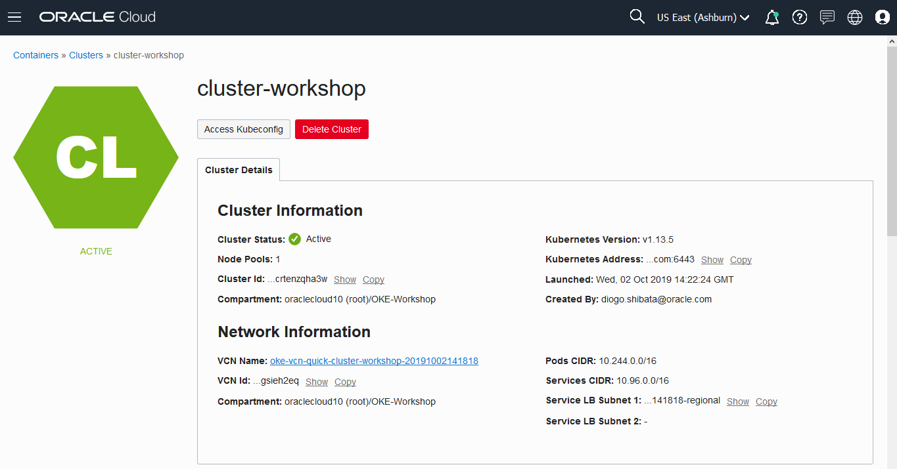

# Creating and managing the Oracle Container Engine for Kubernetes (OKE) cluster

There are many ways to create a OKE Cluster and you will follow by the most simple: a Quick Creation option with no personalization.

## Creating the OKE Managed Service

Menu --> Developer Services --> Container Clusters (OKE)

Select the correct Compartment (*OKE-Workshop*) and click the **Create Cluster** button.

Change the name of the cluster to cluster-workshop and analyze the other data. The panel shows information about the cluster creation. After that click the **Create** button.

Data:

* Name: cluster-workshop
* Kubernetes Version: v1.13.5
* [x] Quick Create
* Shape: VM.Standard2.1
* Quantity per Subnet: 1
* Public SSH Key:
* [x] Kubernetes Dashboard enabled
* [x] Tiller (Helm) enabled
* [x] View Detail Page after this cluster is requested

After the network resources are created, you will see the summary bellow. Click the **Close** button to proceed.

