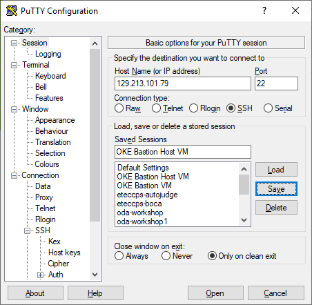

# Creating and managing the Oracle Container Engine for Kubernetes (OKE) cluster

There are many ways to create a OKE Cluster and you will follow by the most simple: a Quick Creation option with no personalization.

## Creating the OKE Managed Service

Menu --> Developer Services --> Container Clusters (OKE)

Select the correct Compartment (*OKE-Workshop*) and click the **Create Cluster** button.

Change the name of the cluster to cluster-workshop and analyze the other data. The panel shows information about the cluster creation. After that click the **Create** button.

Data:

* Name: cluster-workshop
* Kubernetes Version: v1.13.5
* [x] Quick Create
* [x] Private
* Shape: VM.Standard2.1
* Number of Nodes: 2
* Public SSH Key: *leave blank*
* [x] Kubernetes Dashboard enabled
* [x] Tiller (Helm) enabled
* [x] View Detail Page after this cluster is requested

After the network resources are created, you will see the summary bellow. Click the **Close** button to proceed.

You will be redirected to the Cluster Details page. The creation of the cluster will take some time to finish because a transparent Managed Master Node is provisioned before the Worker Nodes are created.

After the creation is completed succesfully, access the section Getting Started.

You will see some information to start the management and the use of the Kubernetes cluster. Click the **Access Kubeconfig** button.

It will open a box with 3 commands:

1. The first creates a directory to export the kubeconfig file.
2. The second generates the kubeconfig file using the already configured (by Terraform) OCI CLI application. **This command is diferent for every cluster**.

* The third sets the KUBECONFIG environment variable.

Copy the three commands for future use.

> NOTE:
>
> We will use the --token-version 1.0.0 config file, that still use the Kubernetes Token to authenticate.
> You will need to change the code from --token-version 2.0.0 to --token-version 1.0.0
> 

The cluster is ready to be used, so let's get inside our Bastion Host VM to start manage the cluster.

## Configuring the Bastion Host VM for your OKE Cluster

You will need to connect to your VM and configure the access to your specifc cluster. You will have to tunnel your remote Bastion Host VM and your local machine at port 8001 to manage from localhost your Kubernetes Dashboard.

So, let's do it!

### Using PuTTY in Windows

Configure your PuTTY connection as the following images.

Inform your Bastion Host IP.

Select the Connection --> Data section and fill the "Auto-login username" with "opc".

Select the Connection --> SSH --> Auth section and find the .ppk file you created with PuTTYgen.

Select the Connection --> SSH --> Tunnels section and fill the "Source port" with "8001" and the "Destination" with "localhost:8001".

Click the **Add** button.

Return to the Session section name the field "Saved Sessions" with "OKE Bastion Host VM" and click the **Save** button.

Accept the host as trustable (click the **Yes** button).

Now you are connected to the Bastion Host VM in Oracle Cloud and the SSH tunnel to the remote port 8001 is up.

Here is a summary of the PuTTY configuration:
  * Session
    * Host Name (or IP Address): 'your_remote_bastion_ip_address'
  * Connection
    * Data
      * Auto-login username: opc
  * Connection
    * SSH
      * Auth
        * Private key file for authentication: 'your_oci_api_key_local_path'/oci_api_key.ppk
  * Connection
    * SSH
      * Tunnels
        * Source port: 8001
        * Destination: localhost:8001
        * Click the **Add** button
  * Session
    * Saved Sessions: OKE Workshop
  * Click the **Save** button
  * Click the **Open** button

You can go directly to the section "Configuring the Bastion Host VM".

### Using Linux Shell or Windows PowerShell

Open the PowerShell and go to the directory where your keys are saved.

Type the command to connect to your Bastion Host VM:

>
> ssh opc@'your_bastion_host_ip' -i .\oci_api_key.pem -L 8001:localhost:8001
>

And type "yes" to accept the host as trustable.

Now you are connected to the Bastion Host VM in Oracle Cloud and the SSH tunnel to the remote port 8001 is up.

### Already connected

After you connect to your Bastion Host VM, run the following commands:

    oci setup repair-file-permissions --file /home/opc/.oci/oci_api_key.pem

Now you are ready to run the commands of the "Getting Started" session of the Cluster Details page.

**Pay attention to the version used in th command! It must be *--token-version 1.0.0***

After the Kubeconfig file is configured, run the following commands to get some important information we will need later:

    cat ~/.kube/config | grep token && cat ~/.kube/config | grep server
    kubectl proxy

and access the Kubernetes from your local browser through the localhost address:

<http://localhost:8001/api/v1/namespaces/kube-system/services/https:kubernetes-dashboard:/proxy/>

You must select the Token option and paste the token you can get from the shell terminal.

You are logged in the Kubernetes Dashboard!

Now you can much easily follow the steps of [Container Native Development Workshop](https://oracle.github.io/learning-library/workshops/container-native-development/?version=Virtual+Box&page=LabGuide100.md) that is partially translated (with some more explanations) on [this manual](https://www.manula.com/manuals/hoshikawa-cristiano/devops-containers/1/pt/topic/devops-com-oracle-container-pipelines).

Go to the [Lab 300: Final Labs and Files](https://github.com/diogoshibata/terraform-bastion/blob/master/Lab%20300/lab300.md) finish this workshop.
